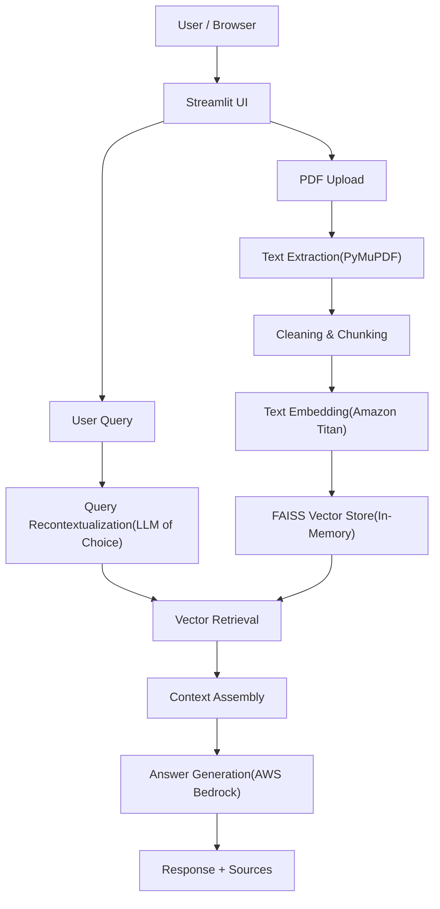

# AWS and LangChain Integrated RAG Based Research Assistant

A End-to-End Self Hosted History Aware Retrieval-Augmented Generation (RAG) Research Assistant Designed for Exploring Academic Papers. This application allows users to upload multiple research PDFs, semantically index them, and ask natural-language questions that are answered **strictly from the uploaded papers**, deployable locally or with AWS EC2.

Built using **LangChain**, **FAISS**, LLama **AWS Bedrock**, **AWS EC2** and **Streamlit**, the system performs context-aware retrieval with conversational memory, making it ideal for literature review, paper comprehension, and technical research workflows, designed as an ephemeral, in-memory system, optimized for rapid, one-off exploration.

## Features
- Upload and index multiple PDF research papers
- Ask questions about your papers using natural language
- Context-aware retreival with chat history
- Vector search powered by FAISS
- AWS Bedrock for intelligent responses

## Architecture

## Architecture



## Prerequisites
- Python 3.8+
- AWS Account with Bedrock access
- AWS credentials configured

## AWS Setup

### 1. Enable Bedrock Model Access
1. Go to AWS Console → Bedrock
2. Navigate to "Model access" in the left sidebar
3. Request access to Claude models (anthropic.claude-3-sonnet or similar)
4. Wait for approval (usually instant for Sonnet)

### 2. Create IAM User with Bedrock Permissions
1. Go to IAM → Users → Create User
2. Attach policy: `AmazonBedrockFullAccess` (or create custom policy with `bedrock:InvokeModel`)
3. Create access keys → Save your Access Key ID and Secret Access Key

### 3. Configure AWS Credentials

AWS CLI:
```bash
aws configure
# Enter your Access Key ID
# Enter your Secret Access Key
# Enter region (e.g., us-east-1)
```

## Local Setup

1. Clone the repository
```bash
git clone https://github.com/yourusername/research-assistant.git
cd research-assistant
```

2. Create virtual environment
```bash
python -m venv venv
source venv/bin/activate  # On Windows: venv\Scripts\activate
```

3. Install dependencies
```bash
pip install -r requirements.txt
```

4. Configure the application
```bash
cp config.example.py config.py
# Edit config.py with your preferred settings
```

5. Run the application
```bash
streamlit run app.py
```

## EC2 Deployment

### 1. Launch EC2 Instance
- AMI: Ubuntu Server 22.04 LTS
- Instance Type: t2.medium or larger
- Security Group: Allow inbound on port 8501 (Streamlit)
- Attach IAM role with Bedrock permissions (instead of access keys)

### 2. Connect and Setup
```bash
ssh -i your-key.pem ubuntu@your-ec2-ip

# Install Python and dependencies
sudo apt update
sudo apt install python3-pip python3-venv -y

# Clone and setup project
git clone https://github.com/yourusername/research-assistant.git
cd research-assistant
python3 -m venv venv
source venv/bin/activate
pip install -r requirements.txt
```

### 3. Run with Screen (keeps running after disconnect)
```bash
screen -S streamlit
streamlit run app.py --server.port 8501 --server.address 0.0.0.0
# Press Ctrl+A then D to detach
# Use `screen -r streamlit` to reattach
```

### 4. Access the app
Navigate to `http://your-ec2-public-ip:8501`

## Usage

1. Upload PDF research papers in the "Upload Papers" tab
2. Wait for processing and indexing
3. Switch to "Ask Questions" tab
4. Ask questions about your papers
5. View sources for transparency

## License

MIT License
